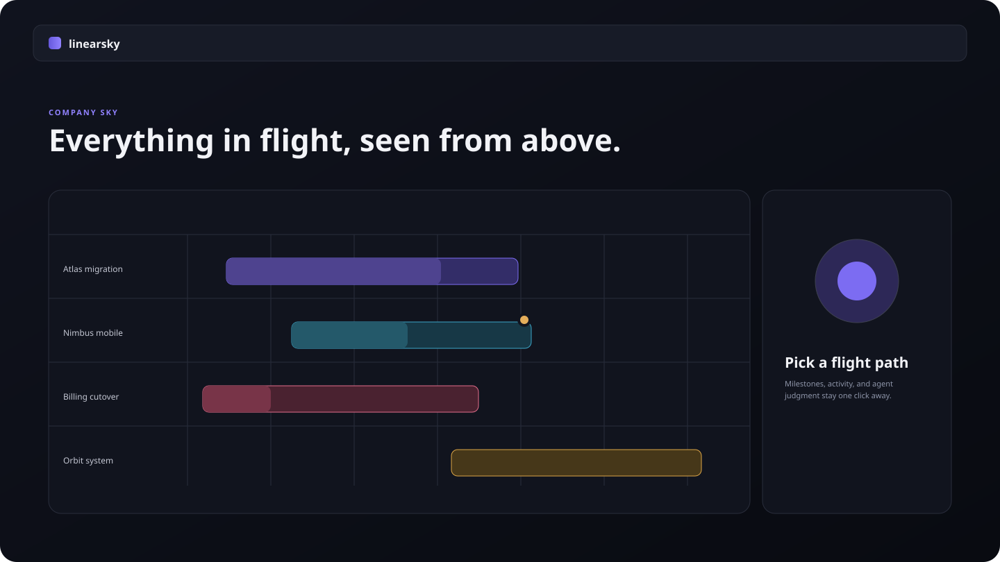

# linearsky

[](LICENSE)

**Your Linear workspace, seen from above.** linearsky turns every active project into a colored flight path across one shared calendar, with progress, delivery pace, milestones, staleness, and optional judgment from any CLI agent you already use.

It is local-first, read-only, and open source. There are no hosted accounts, no background daemon, and zero LLM calls in the app.



## From zero to your sky in 60 seconds

You need Node.js 20.19+ and a [Linear personal API key](https://linear.app/settings/api).

```bash
mkdir company-sky && cd company-sky
npx linearsky
```

On first run, paste your key into the prompt. linearsky stores it with owner-only permissions at `$XDG_CONFIG_HOME/linearsky/config.json`, or `~/.config/linearsky/config.json` when `XDG_CONFIG_HOME` is unset. It then pulls a read-only snapshot into `.linearsky/snapshot.json`, starts the local viewer, and opens your browser.

```bash
npx linearsky pull                         # refresh the local snapshot
npx linearsky start                        # pull, serve, and open the sky
npx linearsky export --output sky.html     # create one standalone HTML file
```

The key is sent only to `https://api.linear.app/graphql`. Set `LINEAR_API_KEY` if you prefer environment-only credentials.

## Try the full demo without a Linear key

From a clone of this repository:

```bash
npm install
npm run build
LINEARSKY_FIXTURE=1 npx . start
```

Fixture mode writes a realistic snapshot and assessment to the current folder, so spans, milestone ticks, pace tints, the undated shelf, and the side panel are all available for review.

## The agent bridge is just files

linearsky is a deterministic viewer. Your agent is a guest analyst. The entire boundary is plain JSON and Markdown:

```text
Linear GraphQL → .linearsky/snapshot.json → linearsky UI
                            ↑
your CLI agent → .linearsky/annotations/*.md
```

Give any CLI agent [`skills/sky-assess/SKILL.md`](skills/sky-assess/SKILL.md). It owns the annotation schema and instructs the agent to read the snapshot, optionally cross-check context through its own connections, and write an evidence-based assessment.

The local server watches that folder and updates the open view immediately. Malformed files are skipped and surfaced as a warning; they never take down the sky.

## How the signals work

- **Progress** uses completed/total issues, weighted by estimates when estimates are present; each unestimated issue in a mixed project receives one unit of weight.
- **Pace** compares percent time elapsed with percent work complete. Projects missing either date show no pace classification. Green, amber, and red thresholds live in [`src/shared/config.ts`](src/shared/config.ts).
- **Milestones** appear as diamonds on each project path and fill when their linked issues are complete.
- **Staleness** marks projects with no project or issue movement in seven days.
- **Missing dates** move to the holding-pattern shelf instead of disappearing.

If Linear cannot be reached during `start`, linearsky serves the last snapshot with a stale banner. Refresh is always manual—there is no polling.

## Develop and verify

```bash
npm install
npm run typecheck
npm test
npm run build
npm run test:e2e
```

The architecture and v1 boundaries are recorded in [`docs/design.md`](docs/design.md). Hosted mode, OAuth, Slack sending, Linear writes, agent dispatch, auto-polling, and workload lanes are intentionally outside v1.

## License

[MIT](LICENSE)
